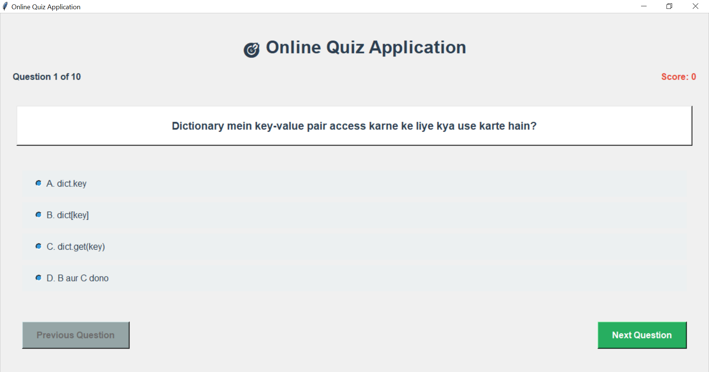

# 🎯 Online Quiz Application (Python + Tkinter)

This is a beginner-friendly, interactive **Python quiz app** built using `Tkinter`.  
It asks 10 multiple-choice questions in Hindi on Python fundamentals and evaluates your score.

---

## 📸 Screenshot



---

## 🧠 Features

- 📋 **10 random Python MCQs** in Hindi
- 🎨 Simple GUI using `Tkinter`
- ✅ Auto scoring & result percentage
- 🔁 Retry option
- 🎉 Motivational performance messages
- 📊 Progress bar based on your score

---

## 🛠️ Technologies Used

- Python 3.x
- Tkinter (GUI)
- `ttk` for progress bar
- `random` module for shuffling questions

---

## 🚀 How to Run

1. **Clone or Download this Repository**
2. Run the script:

```bash
python quiz_app.py
